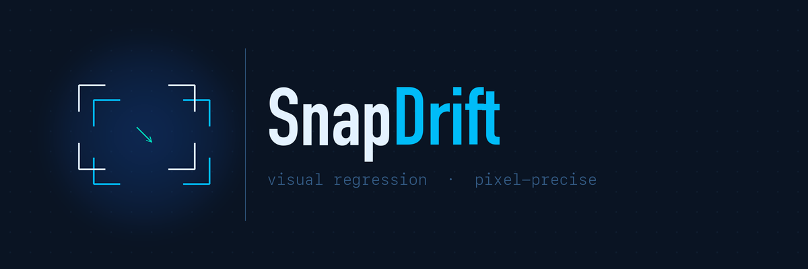

# SnapDrift




SnapDrift captures full-page application frames, compares them against a known baseline, and reports drift directly in GitHub Actions.

SnapDrift is ready to integrate from public GitHub releases. Workflow examples below use the first public tag for readability; security-conscious consumers can pin the resolved commit SHA instead.

## What SnapDrift handles

- Baseline capture on `main`
- Pull request drift detection against the latest successful baseline
- Route scoping from changed files
- PR report upserts
- Drift enforcement through `diff.mode`

You keep ownership of checkout, build, startup, readiness, and teardown. SnapDrift takes over once the app is reachable.

## Quickstart

**1. Add `.github/snapdrift.json` to your repo:**

```json
{
  "baselineArtifactName": "my-app-snapdrift-baseline",
  "workingDirectory": ".",
  "baseUrl": "http://127.0.0.1:8080",
  "resultsFile": "qa-artifacts/snapdrift/baseline/current/results.json",
  "manifestFile": "qa-artifacts/snapdrift/baseline/current/manifest.json",
  "screenshotsRoot": "qa-artifacts/snapdrift/baseline/current",
  "routes": [
    { "id": "home-desktop", "path": "/", "viewport": "desktop" },
    { "id": "home-mobile", "path": "/", "viewport": "mobile" }
  ],
  "diff": { "threshold": 0.01, "mode": "report-only" }
}
```

**2. Publish a baseline on push to `main`:**

```yaml
- name: SnapDrift Baseline
  uses: ranacseruet/snapdrift/actions/baseline@v0.2.0
  with:
    repo-config-path: .github/snapdrift.json
```

**3. Run SnapDrift on pull requests:**

```yaml
- name: SnapDrift Report
  uses: ranacseruet/snapdrift/actions/pr-diff@v0.2.0
  with:
    github-token: ${{ secrets.GITHUB_TOKEN }}
    repo-config-path: .github/snapdrift.json
```

That is the full integration. See the [Integration Guide](docs/integration-guide.md) for workflow examples, permissions, compatibility notes, and advanced overrides.

## Local CLI

SnapDrift ships a `snapdrift` CLI for running captures and diffs locally against a running app — no GitHub Actions required. Use it during development to validate UI changes before pushing.

```bash
# Capture a baseline
snapdrift capture

# Compare against it after making UI changes
snapdrift diff --open
```

See the [Local CLI guide](docs/local-cli.md) for installation, all flags, directory layout, and examples.

## Drift modes

Start with `report-only` while baselines settle. Move to `fail-on-changes` or stricter modes once the signal is stable.

| Mode | Stops the run when |
|------|--------------------|
| `report-only` | Never |
| `fail-on-changes` | Any capture exceeds threshold |
| `fail-on-incomplete` | Captures are missing, dimensions shift, or comparison errors occur |
| `strict` | Any drift signal or incomplete comparison appears |

## Current constraints

- Ubuntu runners only
- Full-page capture only
- Viewport presets: `desktop` (1440×900) and `mobile` (390×844), or custom `{ "width": number, "height": number }`
- One global `diff.threshold`
- Dimension shifts are reported separately from pixel drift

## Docs

- [Integration Guide](docs/integration-guide.md)
- [Local CLI](docs/local-cli.md)
- [Contracts](docs/contracts.md)
- [Changelog](CHANGELOG.md)
- [Contributing](CONTRIBUTING.md)
- [License](LICENSE)
